# Exploratory Data Analysis - Healthcare Claims Dataset
This report outlines the characteristics of the input dataset, presents insights derived from the analysis, and examines patterns and anomalies that may indicate fraudulent activity.

---

# 1. Basic Statistics
| Dataset                  | Rows    | Columns | Memory Usage |
|---------------------------|---------|---------|--------------|
| **Beneficiary Data**      | 138,556 | 25      | 26.4 MB      |
| **Provider Fraud Labels** | 5,410   | 2       | 84.7 KB      |
| **Inpatient Claims**      | 40,474  | 30      | 9.3 MB       |
| **Outpatient Claims**     | 517,737 | 27      | 106.7 MB     |

# 2. Observations on EDA
## Age Distribution Comparison

<table>
  <tr>
    <td>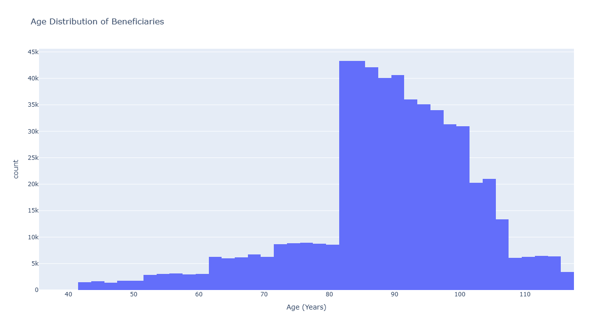</td>
    <td></td>
  </tr>

  <tr>
    <td></td>
    <td></td>
  </tr>
</table>
Here we can observe that most of the patients lie in the age group 65 - 90 years, From this we can conclude that most of the patients are elderly people.

## Proportions of Fraudulant Cases
- Since we are given information with regards to fraudulent providers and non fraudulent providers we can check the proportions of them.

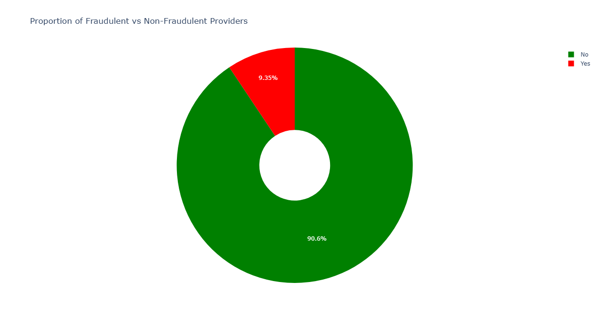

- Following we present the top providers amongst the ones who are potentially fraudulent comparing them on the number of cases.

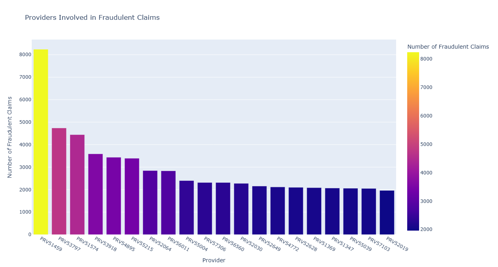

- Since we can have seasonal diseases that can come into picture we can check for fraud and non fraudulent cases per month in the given data and try to find some patterns in that scenario.

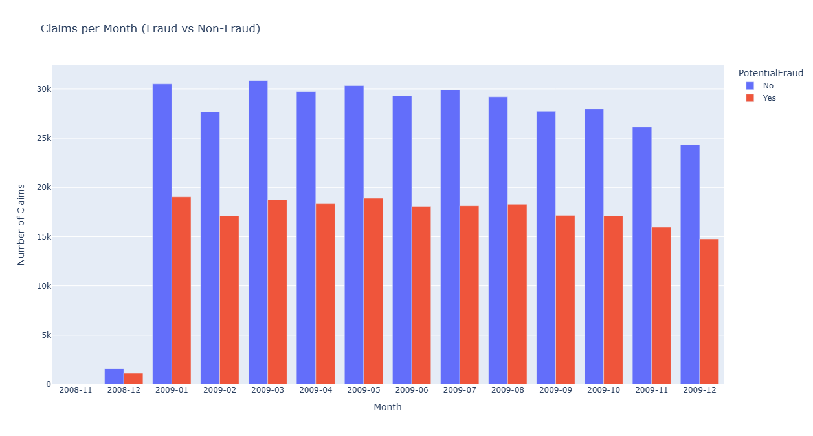

- There is no spike in frauds in any of the months. So we can further check for inpatient and outpatient data for the same to find if there are any situations where fraud can come into picture in outpatient data due to seasonality.

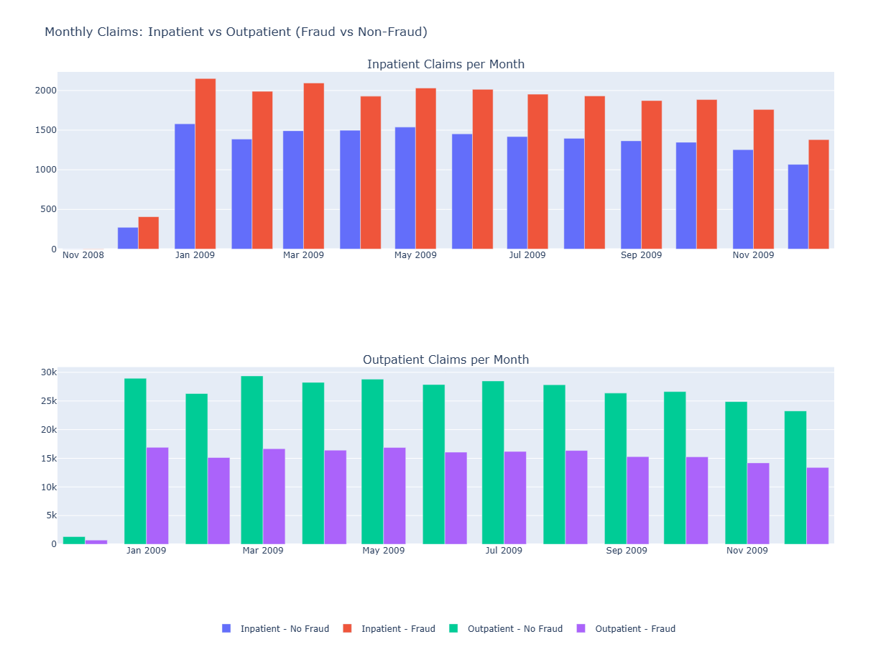

- Here we observe the same where we dont find any patterns pertaining to seasonality in inpatient and outpatient data.

- We can see very small group of providers are fraudulent but we can further compare the porportions of fraudulent in inpatient and outpatient scenarios.

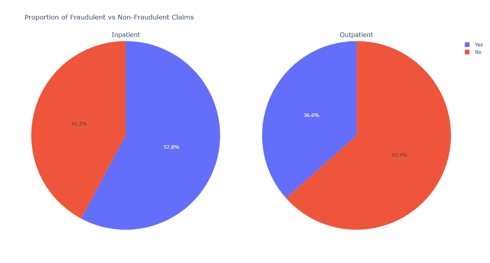

- We can see there are more number of cases which are fraudulent in inpatient than outpatient cases. So we can conclude that providers tend to loot those who are sick for long or suffer any chronic ailments

- Since there are death cases in the given data , we can try to find if there are any cases which are fraudulent. We can already observe that there is a very small proportion in this further investigation in this line may not be very fruitful for now.

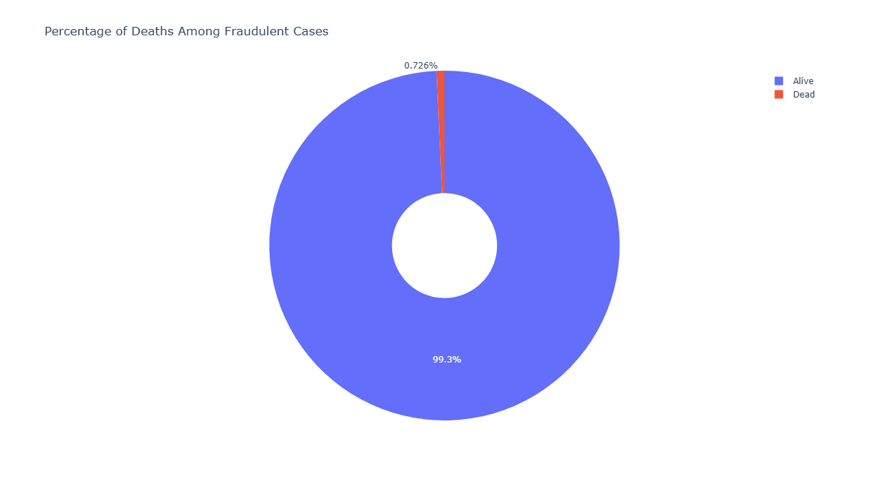

- Further we can investigate what are the diagnosis' that could have had more number of fraudulent cases. Since there was not sufficient information that could map diagnosis code to disease we could provide only following.

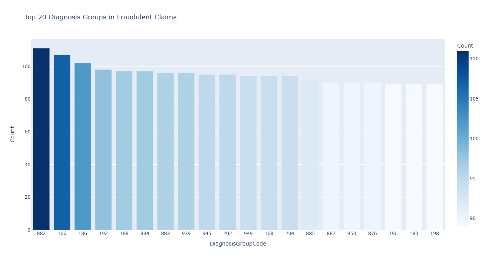

- Since we already observed that proportion of inpatient frauds are high we can compare the data of chronic ailments between in patient and outpatient. Following we can observe that inpatient data points are having more fraudulent cases in all the possible ailments

<table>
  <tr>
    <td>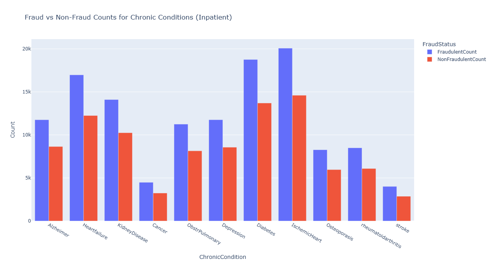</td>
    <td>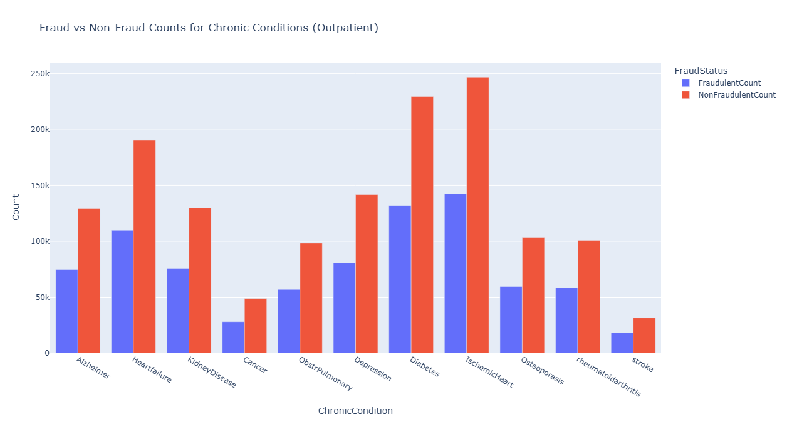</td>
  </tr>
</table>

- Since we can see chronic ailments can be more probable frauds we can expect them to have some kind of operating procedures done. So we can definitely check this areas where there frauds can be more prevailant.

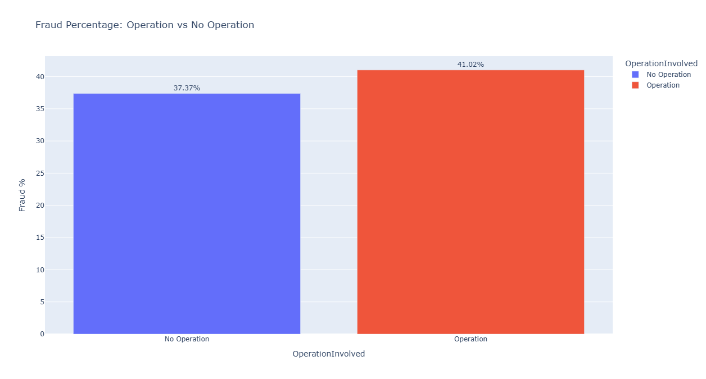

- The data presented in the plot above tells that the operating cases which might require the patient to stay longer in the hospital can lead to more fraudulent cases, also this goes in line with the initial observation of inpatient data having more fraud cases.

- Following are few results on the top states invovled in the fraudulent claims where we can compare healthcare governance. Also further we can see the comparison of genders with respect to chronic diseases. This aspect can be further investigated who are more prone to be victims of fraudulent cases. 

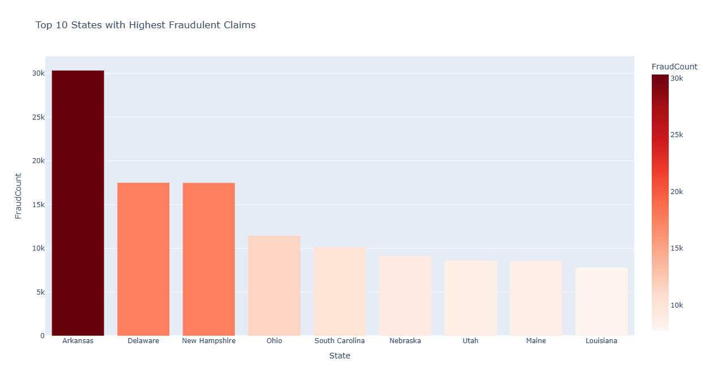
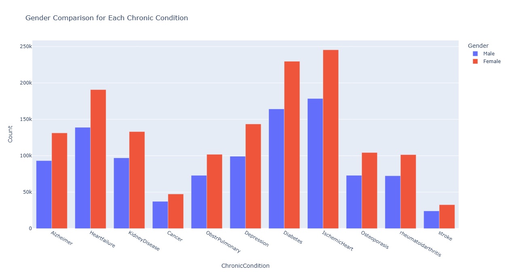

- These are the few outcomes of initial EDA that was performed on the given data. Presented any data with respect to medication we can further investigate in line of what could be the patterns there.